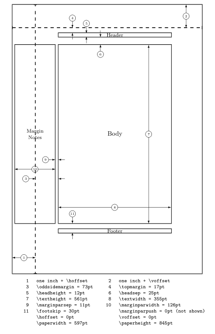

# fancyhdr and extramarks

## Using _fancyhdr_

```tex
\fancyhead[places]{field}
\fancyhead[places]{field}
\fancyhead[places]{field}
```

Here _places_ is a comma-separated list of places where _field_ will be placed.<br>
There are 12 places defined: Left, Center and Right Headers and Footers, and
both can be on Even or Odd pages

```tex
\fancyheadoffset[places]{field}
\fancyheadoffset[places]{field}
\fancyheadoffset[places]{field}
```
These define offsets to let the headers stick into the margin (or to the inside
if negative). Places cannot contain the C specifier.

```tex
\headrulewidth
\footrulewidth
\headrule
\footrule
\headwidth
```

`\headrulewidth` and `\footrulewidth` are macros to define the thickness of a
line under the header and above the footer.<br>
`\headrule` and `\footrule` are macros to completely redefines these lines. And
`\headwidth` is a length parameter that defines the total width of the headers
and footers.

```tex
\iftopfloat
\ifbotfloat
\ifflatpage
\iffootnote
```

These are macros to detect if there is a float on the top or the bottom of the
page, or the page is a float page, or if there is a footnote at the bottom of
the page. These can be used to choose different headers and/or footers if these
conditions are met.

## Using _extramarks_

The `extramarks` gives you some extra marks in LaTeX, besides the normal
`\leftmark` and `\rightmark`, that are defined by the `\markboth` and
`\markright` commands.

```tex
\firstleftmark
\lastrightmark
\firstrightmark
\lastleftmark
```

```tex
\extramarks{aa}{bb}
\firstleftxmark
\firstrightxmark
\topleftxmark
\toprightxmark
\lastleftxmark
\lastrightxmark
\firstxmark
\lastxmark
\topxmark
```

The command `\extramarks{aa}{bb}` defines two extra marks, similar to the
standard ones by latex, where _aa_ is the left one and _bb_ is the right one.
The other commands are to extract these in the headers and footers, similar to
the ones without the x.

## Page Layout in LaTeX



## Introduction

There are a number of things that you must be aware of:
1. The margins on the left are not called `\leftmargin`, but `\evensidemargin`
   (on even-numbered pages) and `\oddsidemargin` (on odd-numbered pages).
   In one-sided documents `\oddsidemargin` is used for either.<br>
   `\leftmargin` is also a valid LaTeX parameter but has a different use (namely
   the indentation list parameter).
2. Most of the parameters should not be changed in the middle of a document.
   Some changes might work at a pagebreak. If you want to change the height of a
   single page, you can use `\enlargethispage` command.

The margin notes area contains small pieces of information created by the
`\marginpar` command. On twosided documents the margin notes appear on the left
and right alternatively. The margin notes are not on fixed places with respect
to the paper but at approximately the same height as the paragraph in which they
appear. Due to the algorithm used to decide the placement of margin notes, in a
twosided document unfortunately they may appear on the wrong side if they are
close to a page break.

## Page Headers and Footers

The page headers and footers in LaTeX are defined by the `\pagestyle` and
`\pagenumbering` commands. `\pagestyle` defines the general contents of the
headers and footers, while `\pagenumbering` defines the format of the page
number.<br>
LaTeX has four standard page styles:
___
| Style Name | Style description |
| :--- | :--- |
| empty | no headers or footers |
| plain | no header, footers contains page number centered |
| headings | no footers, header contains name of chapter/section and/or subsection and page number |
| myheadings | no footer, header contains page number and user supplied information |
