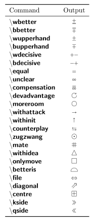
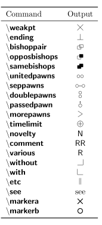

# Skak Package

## Commands

### Basic Commands
```tex
\newgame
\mainline{Algebraic Notation}
\variation{Algebraic Notation}
\showboard
```

### Intermediate Commands

#### Game Management

__Fast-Forward to any point in a game__

```tex
\hidemoves{Algebraic Notation}
```
__Storing game positions__

1. _In Memory_

```tex
\savegame{name}
\loadgame{name}
```

2. _In a File_

```tex
\storegame{name}
\restoregame{name}
```

#### Ornaments

1. Marker that shows next to the board indicating who is to move next.

Works only  if the `skak` package is loaded with the __ps__ option.

```tex
\mover
\moveroff
```

2. Showing or not the notation

```tex
\notationoff
\notationon
```

3. Black prospective

```tex
\showinverseboard
```

4. Handy Commands

```tex
\wmove{Algebraic Notation of the move}
\bmove{Algebraic Notation of the move}
\lastmove{}
```
### Advance Usage

#### Tailoring the Board Appearance

```tex
\showonlywhite
\showonlyblack
\showonly{P,p,Q,q,K,k,N,n,B,b,R,r}
\showallbut{P,p,Q,q,K,k,N,n,B,b,R,r}
```

#### Setting up the Board

```tex
\fenboard{FEN}
```

#### Typesetting Style

##### Styles

```tex
\styleA
```
White and black moves are separated by a comma and the move number is followed
by a dot

```tex
\styleB
```
No punctuation (default)


```tex
\styleC
```
Is an elaboration on styleB: it typesets the moves line by line for each move
for the mainline but on the same line for variations

##### Style Configuration

```tex
\def\mainlinestyle{style_configuration}
\def\variationstyle{style_configuration}
```

```tex
\longmoves
\shortmoves
\sanmoves
```

#### Input Language

```tex
\newskaklanguage{italian}{RDTACP}
\skaklanguage[italiano]
```
Allow to use the algebraic notation of the configured language to typesets
algebraic notation in mainline{} and variation{} ...

### Informator Symbols





For a summary of all the command see [reference manual](./refman.pdf)
