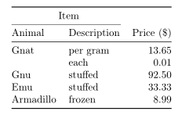

# Tables

## Booktabs

### Layout of Formal Tables

Guidelines:
1. Never, ever use vertical rules
2. Never use double rules.
3. Put the units in the column heading (not in the body of the table)
4. Always precede a decimal point by a digit
5. Do not use 'ditto' signs or any other such convention to repeat a previous
   value. In many circumstances a blank will serve just as well. If it won't,
   then repeat the value

### New Commands

```tex
\toprule
\midrule
\bottomrule
```

The rule commands here all take a default which may be reset within the
document (preferably, but not necessarily, in the preamble). For the top and
bottom rules this default is `\heavyrulewidth` and for midrule it is
`\lightrulewidth`.

In very rare cases where you need to do something special, you may use the
optional arguments to the rule commands which have formal syntax as follows:

```tex
\toprule[wd]
\midrule[wd]
\bottomrule[wd]
```
where wd is a TeXdimension.

All the rule commands described here go after the closing `\\` of the preceding
row (except '\toprule', which comes right after the `\tabular{}` command); in
other words, exactly where plain Latex allows `\hline` or `\cline`.

Frequently we need a sub-rule to extend over only some of the columns, for
which we need a `\cmidrule` (the analogue of Latex’s '\cline' command).
Generally, this rule should not come to the full width of the columns, and this
is especially the case when we need to begin a `\cmidrule` straight after the
end of another one (Latex’s `\clines` crash into each other here if you are
not extra careful with `\extracolsep`). Thus, you will generally want to use the
optional _"trimming"_ commands.
The trimming commands, if used at all, go in parentheses, with no spaces
separating them. The possible specifications are r, r{wd}, l and l{wd}, or any
combinations of these, where ws is a dimension, and r and l indicate whether the
right and/or left ends of the rule should be trimmed.
The form without explicit argument is equivalent to `r{\cmidrulekern}`
where `\cmidrulekern` defaults to 0.5 em, but can be set by the user in the
preamble.
Here’s an illustrative example: `(lr{.75em})` gives you a default left trim
and exactly 0.75 em right trim. Equally valid here is `(r{.75em}l)`

The full syntax of the command is:

```tex
\cmidrule[wd](trim){a-b}
```

Occasionally we want to put an extra space between certain rows of a table;
for example, before the last row, if this is a total.
This is simple a matter of inserting

```tex
\addlinespace[wd]
```
after the `\\` alignment marker. Between ordinary rows of text, the effect
is identical to the ordinary Latex usage `\\[\defaultaddspace].
Also, it can be used before, after or between rules if you want to control
the exact amount of space to be inserted.

### Example

```tex
\begin{tabular}{@{}llr@{}}
  \toprule
  \multicolumn{2}{c}{Item} \\
  \cmidrule(r){1-2}
  Animal & Description & Price (\$)\\
  \midrule
  Gnat & per gram & 13.65 \\
       & each     &  0.01 \\
  Gnu  & stuffed  & 92.50 \\
  Emu  & stuffed  & 33.33 \\
  Armadillo & frozen & 8.99 \\
  \bottomrule
\end{tabular}
```


`@{}` allow to trim the horizontal margin of the table

### Abuse of the new commands

If your perversion is to want double `\cmidrule` you will need the extra
command `\morecmidrules` to do so properly, beceause normally two `\cmidrule`
in a row is a sane construction calling for two rules on the same "rule row".
Thus you have to write:

```tex
\cmidrules{1-2}\morecmidrules\cmidrules{1-2}
```
(note: since a `\cmidrule` is generally very light, the ordinary `\doublerulesep`
is probably too much space)

If you find some extraordinary need to specify exactly 0.5 em, say, between two
rules, you could use a construction such as `\midrule \addlinespace[.5em]
\midrule`
In a rare fit of tolerance, though, I have also provided the command:
```tex
\specialrule{wd}{abovespace}{belowspace}
```
where all three arguments are mandatory
